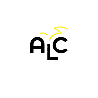

# ALC Starter Kit {#alc-starter-kit}

## Starter Kit: Volume I**

The Starter Kit is organized into three main parts. Founders/Directors/Coherence-Holders will need be familiar with all three sections, but many people involved in running an ALC will primarily be drawn to one of these sections which connects most to the focus of their work.

[Organization & Administration](export/organization_&_administration/index.html) is about getting the ball rolling, building your team, setting up your initial administrative infrastructure, and managing it all once it’s up and going.

[Communication & Promotion](export/communication_&_promotion/README.md) contains an overview of our educational model. It also covers how to talk about ALCs and reach the people you need to get involved and how to set up the marketing and communications tools you’ll need to keep communications flowing.

[Facilitation & Daily Operation](export/facilitation_&_daily_operation/README.md) contains all our tools and practices for the people working with the students on a daily basis and fostering a healthy culture in the school.


